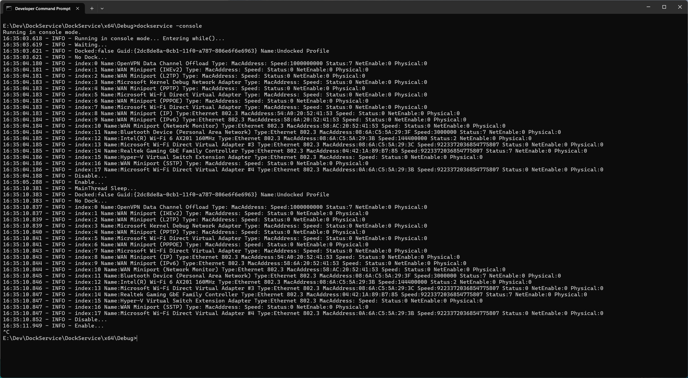

# DockService

If the dock is present, disable  Wi-Fi network configuration using WMI.

# Architecture Technique

La solution est constituée de 2 projets :
-	Un EXE pour le service nommé DockService.exe
-	Une DLL pour les services techniques partagés nommée MySharedStuff64.dll

Le service est un exécutable console qui est utilisée comme suit :
-	Avec le flag -console pour être utilisé comme un outils console ; ce mode permet de debugger facilement
-	Avec le flag -createservice pour enregistrer le service Windows ; le démarrage se fait via un net start DockService et l’arrêt via un net stop DockService

Le module MySharedStuff contient les classes suivantes :
-	Base64Helper : gestion du encode/decode base 64
-	BasicLogger : un simple gestionnaire de log
-	CSWMRGuard : verrou Single Writer Multiple Readers
-	DataHandler : contient la liste des données WMI ; ici c’est la liste des interfaces réseaux
-	CNetworkCard : classe de données d’une interface réseau
-	Logger : un autre logger mais non utilisé
-	ManagementClass : classe de gestion des API WMI
-	WorkerItemHandler : récupère les interfaces réseaux via le wrapper des API WMI

Le module DockService.exe est conçu ainsi :
-	DockService.cpp contient le point d’entrée wmain et traite les modes de flags -console ou -createservice
-	CServiceModule : cette classe contient le service Windows avec les routines de gestion d’arrêt et de démarrage du service, la routine principale qui tourne en boucle nommée AutomateThread et la routine de code principale MainRoutine.
MainRoutine est une simple fonction C réalise plusieurs opérations :
-	Appel à Win32 GetCurrentHwProfile pour déterminer la présence d’un dock
-	Enumération de la liste des interfaces réseaux avec récupération des propriétés Index, Name, etc
-	Affichage des interfaces réseaux collectées
-	Utilisation d’un nouvel objet ManagementClass pour faire un appel de méthode WMI Enable ou Disable si l’interface réseau contenant Wi-Fi est connectée

